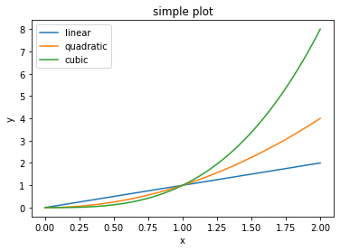

# 第一章 初识matplotlib

1. matplotlib是啥：

   简单来理解，它是python其中的一个2D绘图库，这个库用来制作2D的各种图形，是python数据可视化库中的元老，其它各种库比如seaborn等都是基于matplotlib的高级封装。

2. 简单绘图：

   matplotlib中提供了两种最简单的绘图接口：

   - 直接显式定义figure以及axes，在上面调用绘图方法，这种也称为OO模式（object-oriented style)
   - 依赖包默认创建figure与axes并绘图

   第一种显式定义的简单实现

   ```python
   import matplotlib.pyplot as plt
   import numpy as np
   
   %matplotlib inline
   
   x = np.linspace(0,2,100)
   
   figure, ax = plt.subplots()
   ax.plot(x, x, label='linear')
   ax.plot(x, x**2, label='quadratic')
   ax.plot(x, x**3, label='cubic')
   ax.legend()
   ax.set_xlabel('x')
   ax.set_ylabel('y')
   ax.set_title('sinple plot')
   plt.show()
   ```

   第二种非显式定义的简单实现

   ```python
   import matplotlib.pyplot as plt
   import numpy as np
   
   %matplotlib inline
   
   x = np.linspace(0,2,100)
   
   plt.plot(x,x,label='linear')
   plt.plot(x,x**2, label='quadratic')
   plt.plot(x,x**3, label='cubic')
   plt.legend()
   plt.xlabel('x')
   plt.ylabel('y')
   plt.title('simple plot')
   plt.show()
   ```

   显示的图片都一样，如图：

   

3. 图层讲解

   Marplotlib根据次序可以分成四个层级：

   - Fig：顶层级，用来容纳所有的元素
   - Axes：子图集，容纳了一个子图中的所有元素，同时一个fig中可以出现好几个子图
   - Axis：Axes的下层级，包含了同一个图片中的坐标轴信息，以及网格相关的信息
   - Tick：Axis的下属层级，用来处理所有和刻度相关的元素

   