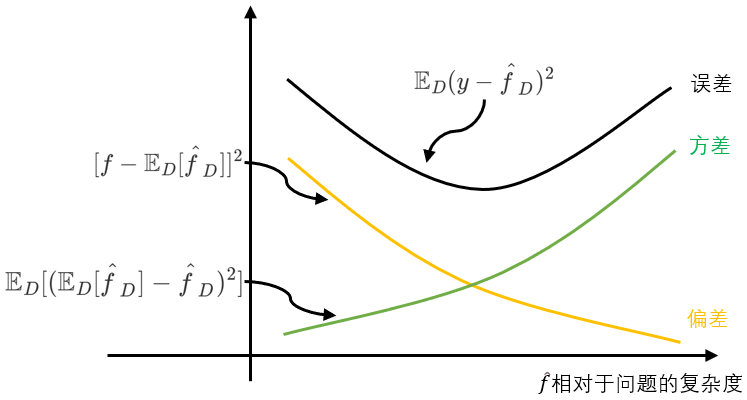

# Chapter2: Ensemble mode

## 1. 为何集成

首先我们回顾一下机器学习的整个过程：我们在有限的数据上训练模型，再用模型去预测新的数据，并期望在新的数据上能够得到较低的预测损失。这里的预测损失可以有很多种：均方误差，错误率等等。那么我们预测数据的损失是从何而来的呢？这个问题直观上并不好直接做解答，我们需要从数学语言加以描述。

首先定义数据，对于实际问题中的数据，我们可以认为它总是由一个分布$p$得到的
$$
\textbf{X}_1,\textbf{X}_2,...,\textbf{X}_n\sim p(\textbf{X})
$$
这些样本对应的标签是通过一个模型$f$和噪声$\epsilon$得到的，即：
$$
y_i = f(\textbf{X}_i)+\epsilon_i,i\in\{1,2,...,n\}
$$
其中我们假设噪声的均值为0方差为$\sigma^2$ 。然后有了训练数据集$D=\{(\textbf{X}_1,y_1), (\textbf{X}_2,y_2),...,(\textbf{X}_n,y_n)\}$之后，我们希望学习一个$\hat{f}$来预测未见过的样本，然后使得损失尽可能小。

这里需要注意，由于往往训练集是从所有样本中采样而来的，我们学习的模型$\hat{f}$实际也是从总体分布产生的随机有限分布中学出来的，我们用$\hat{f}_D$来强调这个随机分布D。以均方误差为例，由于D是一个随机变量，我们本质上优化的损失是$L=\mathbb{E}_D(y-\hat{f}_D(\tilde{\textbf{X}}))^2$ ，这个表示我们希望按照随机分布（由给定的总体分布采样而生成）产生的数据训练出的模型，在真实的值上有较好的预测能力，即较好的泛化能力。

用数学语言描述好了损失之后，我们来分解一下这个损失，看看这个损失是由什么构成的：
$$
\begin{split}
\begin{aligned}
L(\hat{f}) &= \mathbb{E}_D(y-\hat{f}_D)^2\\
&= \mathbb{E}_D(f+\epsilon-\hat{f}_D+\mathbb{E}_D[\hat{f}_{D}]-\mathbb{E}_D[\hat{f}_{D}])^2 \\
&= \mathbb{E}_D[(f-\mathbb{E}_D[\hat{f}_{D}])+(\mathbb{E}_D[\hat{f}_{D}]-\hat{f}_D)+\epsilon]^2 \\
&= \mathbb{E}_D[(f-\mathbb{E}_D[\hat{f}_{D}])^2] + \mathbb{E}_D[(\mathbb{E}_D[\hat{f}_{D}]-\hat{f}_D)^2] + \mathbb{E}_D[\epsilon^2]\\
&+2\mathbb{E}_D[\epsilon (f-\mathbb{E}_D[\hat{f}_{D}])]+2\mathbb{E}_D[\epsilon(\mathbb{E}_D[\hat{f}_{D}]-\hat{f}_D)^2]+2\mathbb{E}_D[(f-\mathbb{E}_D[\hat{f}_{D}])(\mathbb{E}_D[\hat{f}_{D}]-\hat{f}_D)] \\
&= \mathbb{E}_D[(f-\mathbb{E}_D[\hat{f}_{D}])^2] + \mathbb{E}_D[(\mathbb{E}_D[\hat{f}_{D}]-\hat{f}_D)^2] + \mathbb{E}_D[\epsilon^2] \\
&= [f-\mathbb{E}_D[\hat{f}_{D}]]^2 + \mathbb{E}_D[(\mathbb{E}_D[\hat{f}_{D}]-\hat{f}_D)^2] + \sigma^2
\end{aligned}
\end{split}
$$
注意，其中由于$E[\epsilon]$为白噪声始终为零，$\hat{f}_D$在去过期望后变成常数，即$\mathbb{E}_D[\hat{f}_{D}]$为常数，此外：
$$
\begin{split}
\begin{aligned}
&\mathbb{E}_D[(f-\mathbb{E}_D[\hat{f}_{D}])(\mathbb{E}_D[\hat{f}_{D}]-\hat{f}_D)]\\
&=(f-\mathbb{E}_D[\hat{f}_{D}])\{\mathbb{E}_D[(\mathbb{E}_D[\hat{f}_{D}]-\hat{f}_D)]\}\\
&=(f-\mathbb{E}_D[\hat{f}_{D}])\{\mathbb{E}_D[\hat{f}_{D}]-\mathbb{E}_D[\hat{f}_{D}]\}\\
&=0
\end{aligned}
\end{split}
$$
因此在第四个等号这里所有的交叉项均为0，我们能得到最终的结果
$$
L(\hat{f})=[f-\mathbb{E}_D[\hat{f}_{D}]]^2 + \mathbb{E}_D[(\mathbb{E}_D[\hat{f}_{D}]-\hat{f}_D)^2] + \sigma^2\\
泛化误差=偏差+方差+噪声
$$
由上式子我们可以看出，损失可以分解成三个部分：模型的预测值与真实值的偏差，模型本身的方差以及数据中的原始噪声。第一项模型预测值与真实值的偏差能够反映模型预测与真实值的偏离程度，刻画了模型本身的拟合能力。第二项模型的方差反应了模型的抗干扰能力，注意这里的方差是关于随机分布$D$的，度量的是不同训练集的变动对学习性能的影响。第三项为不避免的数据本身产生的原始噪声，这个我们无法通过优化模型来降低。这种分解给了我们一种优化模型的思路，包含两个方向：1.优化降低模型预测的偏差。2.优化降低模型本身的方差。

这里需要提到方差-偏差困境，过于简单的模型（比如线性回归）虽然模型本身方差较小，但是预测能力不强，会产生较大的偏差。而过于复杂的学习器虽然拟合能力很浅，偏差很小，但是由于经常会学到冗余的信息和噪声，模型本身的方差会较大，这里用下图可以直观的看出对于单个学习器，降低方差同时降低偏差比较困难。



从上图可以看出：训练程度不足时，学习器的拟合能力不够强，训练数据的扰动不足以使学习器产生显著变化，偏差将主导泛化错误率。随着训练程度加深，学习器的拟合能力逐渐增强，训练数据发生的扰动逐渐能够被学习器学到，方差将主导泛化错误率。训练程度充足后，学习器的拟合能力已经非常强，训练数据发生的轻微扰动都会导致学习器发生显著变化。训练数据非全局的特征如果被学习器学到了，将发生过拟合。这是方差-偏差困境在西瓜书中的具体表述。

那么很自然的想到，既然同时降低单个模型的偏差与方差比较困难，能否运用多个模型集成来降低偏差或者方差呢？更明确来说：我们希望利用多个低偏差的学习器进行集成来降低模型的方差，或者利用多个低方差学习器进行集成来降低模型的偏差，而bagging方法和boosting方法就分别是这两种思路的具体框架。

## 2. bagging与boosting


## 5. Stacking代码实现

```python
from sklearn.model_selection import KFold
from sklearn.neighbors import KNeighborsRegressor
from sklearn.tree import DecisionTreeRegressor
from sklearn.linear_model import LinearRegression
from sklearn.datasets import make_regression
 
import numpy as np
import pandas as pd
 
m1=KNeighborsRegressor()
m2=DecisionTreeRegressor()
m3=LinearRegression()
 
models=[m1,m2,m3]
 
#from sklearn.svm import LinearSVR
 
final_model=DecisionTreeRegressor()
 
k,m=4,len(models)
 
if  __name__=="__main__":
    X,y=make_regression(
        n_samples=1000,n_features=8,n_informative=4,random_state=0
    )
    final_X,final_y=make_regression(
        n_samples=500,n_features=8,n_informative=4,random_state=0
    )
    
    final_train=pd.DataFrame(np.zeros((X.shape[0],m)))
    final_test=pd.DataFrame(np.zeros((final_X.shape[0],m)))
    
    kf=KFold(n_splits=k)
    for model_id in range(m):
        model=models[model_id]
        for train_index,test_index in kf.split(X):
            X_train,X_test=X[train_index],X[test_index]
            y_train,y_test=y[train_index],y[test_index]
            model.fit(X_train,y_train)
            final_train.iloc[test_index,model_id]=model.predict(X_test)
            final_test.iloc[:,model_id]+=model.predict(final_X)
        final_test.iloc[:,model_id]/=k
    final_model.fit(final_train,y)
    res=final_model.predict(final_test)
```

## 6. Blending代码实现

```python
from sklearn.model_selection import KFold
from sklearn.model_selection import train_test_split
from sklearn.neighbors import KNeighborsRegressor
from sklearn.tree import DecisionTreeRegressor
from sklearn.linear_model import LinearRegression
from sklearn.datasets import make_regression
 
import numpy as np
import pandas as pd
 
m1=KNeighborsRegressor()
m2=DecisionTreeRegressor()
m3=LinearRegression()
 
models=[m1,m2,m3]
 
final_model=DecisionTreeRegressor()
 
m=len(models)
 
if  __name__=="__main__":
    X,y=make_regression(
        n_samples=1000,n_features=8,n_informative=4,random_state=0
    )
    final_X,final_y=make_regression(
        n_samples=500,n_features=8,n_informative=4,random_state=0
    )
    
 
    X_train,X_test,y_train,y_test = train_test_split(X,y,test_size=0.5)
    
    final_train=pd.DataFrame(np.zeros((X_test.shape[0],m)))
    final_test=pd.DataFrame(np.zeros((final_X.shape[0],m)))
    
    for model_id in range(m):
        model=models[model_id]
        model.fit(X_train,y_train)
        final_train.iloc[:,model_id]=model.predict(X_test)
        final_test.iloc[:,model_id]+=model.predict(final_X)
        
    final_model.fit(final_train,y_train)
    res=final_model.predict(final_test)
```

