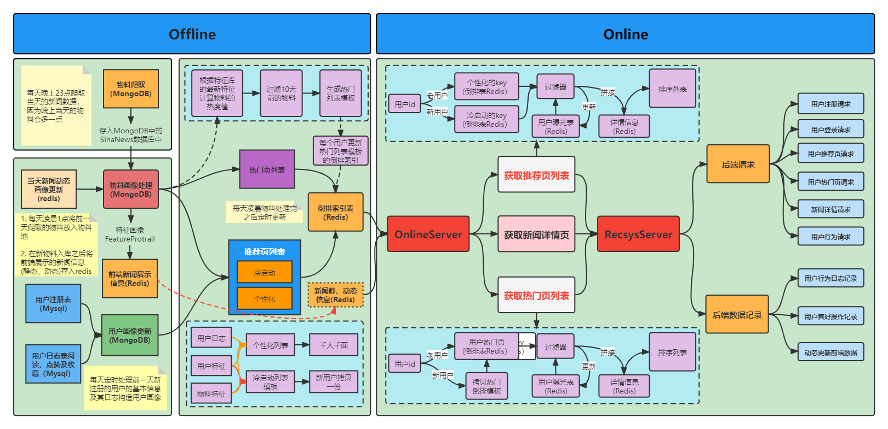

# Task3:离线物料系统的构建



本节中我们主要来了解线下部分，离线物料系统是如何构建出来的。

## 1.离线流程总览

- 物料爬取

  主要使用scrapy对新闻（静态数据）进行爬取，存放于MongoDB的SinaNews数据库中。

- 物料画像构建

  - 更新当天新闻动态画像，将用户对前一天新闻的交互（阅读、点赞和收藏等）存入Redis中（动态数据）
  - 将静态数据和动态数据分别存入对应的Redis中。

- 用户画像构建

  - 用户通过前端注册页面注册后，将用户信息存入MySQL的用户注册信息表（register_user）中；
  - 阅读、点赞及收藏等行为会被记录，这些数据存入MySQL的用户阅读信息表（user_read）、用户点赞信息表（user_likes）和用户收藏信息表（user_collections）；
  - 将当天的新注册用户基本信息及其行为数据构造用户画像，存入MongoDB中的`UserProtrai`集合中。

- 整合画像

  根据物料画像和用户画像整合，构建自动化推荐流程

## 2. 物料爬取部分详解

项目整体模块如下：

```
sinanews--------------------------------------项目python模块
+---__init__.py-------------------------------模块初始化文件
+---items.py----------------------------------items文件，用于定义类对象
+---middlewares.py----------------------------中间件，用于配置请求头、代理、cookie、会话维持等
+---pipelines.py------------------------------管道文件，用于将爬取的数据进行持久化存储
+---run.py------------------------------------单独运行项目的脚本，用于自动化爬取
+---settings.py-------------------------------配置文件，用于配置数据库
+---spiders-----------------------------------爬取新闻模块
|   +---__init__.py---------------------------爬取新闻模块初始化文件
|   +---sina.py-------------------------------爬取新浪新闻的具体逻辑，解析网页内容
scrapy.cfg------------------------------------项目配置文件
```

### 2.1 scrapy基础

- scrapy项目结构：

  默认情况下，所有scrapy项目的项目结构都是相似的，在指定目录对应的命令行中输入如下命令，就会在当前目录创建一个scrapy项目

  ```
  scrapy startproject myproject
  ```

  项目的目录结构如下：

  ```
  myproject--------------------------------------项目python模块
  +---__init__.py-------------------------------模块初始化文件
  +---items.py----------------------------------items文件，用于定义类对象
  +---middlewares.py----------------------------中间件，用于配置请求头、代理、cookie、会话维持等
  +---pipelines.py------------------------------管道文件，用于将爬取的数据进行持久化存储
  +---settings.py-------------------------------配置文件，用于配置数据库
  +---spiders-----------------------------------爬取新闻模块
  |   +---__init__.py---------------------------爬取新闻模块初始化文件
  scrapy.cfg------------------------------------项目配置文件
  ```

- Spider:

  spider是定义一个特定站点（或一组站点）如何被抓取的类，包括如何执行抓取（即跟踪链接）以及如何从页面中提取结构化数据（即抓取项）。换言之，spider是为特定站点（或者在某些情况下，一组站点）定义爬行和解析页面的自定义行为的地方。

  爬行器是自己定义的类，Scrapy使用它从一个网站(或一组网站)中抓取信息。它们必须继承 `Spider` 并定义要做出的初始请求，可选的是如何跟随页面中的链接，以及如何解析下载的页面内容以提取数据。

  对于spider来说，抓取周期是这样的：

  1. 首先生成对第一个URL进行爬网的初始请求，然后指定一个回调函数，该函数使用从这些请求下载的响应进行调用。要执行的第一个请求是通过调用 `start_requests()` 方法，该方法(默认情况下)生成 `Request` 中指定的URL的 `start_urls` 以及 `parse` 方法作为请求的回调函数。
  2. 在回调函数中，解析响应(网页)并返回 [item objects](https://www.osgeo.cn/scrapy/topics/items.html#topics-items) ， `Request` 对象，或这些对象的可迭代。这些请求还将包含一个回调(可能相同)，然后由Scrapy下载，然后由指定的回调处理它们的响应。
  3. 在回调函数中，解析页面内容，通常使用 [选择器](https://www.osgeo.cn/scrapy/topics/selectors.html#topics-selectors) （但您也可以使用beautifulsoup、lxml或任何您喜欢的机制）并使用解析的数据生成项。
  4. 最后，从spider返回的项目通常被持久化到数据库（在某些 [Item Pipeline](https://www.osgeo.cn/scrapy/topics/item-pipeline.html#topics-item-pipeline) ）或者使用 [Feed 导出](https://www.osgeo.cn/scrapy/topics/feed-exports.html#topics-feed-exports) .

  下面是官网给出的Demo:

  ```python
  import scrapy
  
  class QuotesSpider(scrapy.Spider):
      name = "quotes" # 表示一个spider 它在一个项目中必须是唯一的，不同的spider不能被设置相同的名称。
  	
      # 必须返回请求的可迭代(您可以返回请求列表或编写生成器函数)，spider将从该请求开始爬行。后续请求将从这些初始请求中相继生成。
      def start_requests(self):
          urls = [
              'http://quotes.toscrape.com/page/1/',
              'http://quotes.toscrape.com/page/2/',
          ]
          for url in urls:
              yield scrapy.Request(url=url, callback=self.parse) # 注意，这里callback调用了下面定义的parse方法
  	
      # 将被调用以处理为每个请求下载的响应的方法。Response参数是 TextResponse 它保存页面内容，并具有进一步有用的方法来处理它。
      def parse(self, response):
          # 下面是直接从response中获取内容，为了更方便的爬取内容，后面会介绍使用selenium来模拟人用浏览器，并且使用对应的方法来提取我们想要爬取的内容
          page = response.url.split("/")[-2]
          filename = f'quotes-{page}.html'
          with open(filename, 'wb') as f:
              f.write(response.body)
          self.log(f'Saved file {filename}')
  ```

  

- 
