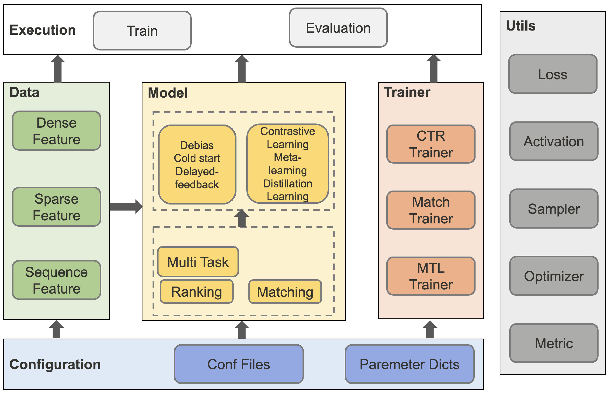

# task01-熟悉torch-rechub框架设计与使用方法

## 1 Torch-rechub框架

### 1.1 框架优势/特性

- `scikit-learn`风格易用的API（`fit`、`predict`），开箱即用
- 模型训练与模型定义解耦，易拓展，可针对不同类型的模型设置不同的训练机制
- 支持`pandas`的`DataFrame`、`Dict`等数据类型的输入，降低上手成本
- 高度模块化，支持常见 Layer，容易调用组装形成新的模型
  - LR、MLP、FM、FFM、CIN
  - target-attention、self-attention、transformer
- 支持常见排序模型
  - WideDeep、DeepFM、DIN、DCN、xDeepFM等
- 支持常见召回模型
  - DSSM、YoutubeDNN、YoutubeDSSM、FacebookEBR、MIND等
- 丰富的多任务学习支持
  - SharedBottom、ESMM、MMOE、PLE、AITM等模型
  - GradNorm、UWL、MetaBanlance等动态loss加权机制
- 聚焦更生态化的推荐场景
- 支持丰富的训练机制

### 1.2 整体架构

- Data类
  - Dense Feature: 数值型特征
  - Sparse Feature：类别型特征（通过labelEncoder得到embedding）
  - Sequence Feature：序列特征

- Model类

  1. 通用layer
     - 浅层特征
       - LR, MLP, EmbeddinLayer
     - 深层特征
       - FM、FFM、CIN
       - self-attention、target-attention、transformer

  2. 总体模型

     - 排序模型：WideDeep、DeepFM、DCN、xDeepFM、DIN、DIEN、SIM

     - 召回模型：DSSM、YoutubeDNN、YoutubeSBC、FaceBookDSSM、Gru4Rec、MIND、SASRec、ComiRec
     - 多任务模型：SharedBottom、ESMM、MMOE、PLE、AITM

- Trainer类

  目前支持三种Trainer

  - CTRTrainer: 精排模型训练与评估，支持BCE Loss
  - MTLTrainer: 多任务排序模型训练与评估，分类任务支持BCE Loss，回归任务支持MSE Loss
  - MatchTrainer：召回模型训练与评估，
    Point-wise样本构造：BCE Loss
    Pair-wise样本构造：BPR Hinge Loss
    List-wise样本构造：softmax Loss
    向量化召回：使用annoy

## 2. 构建案例

