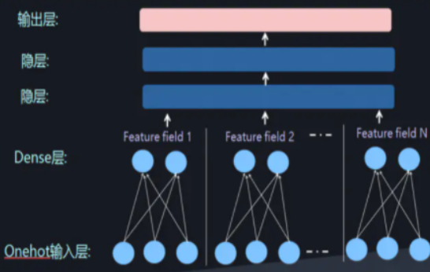
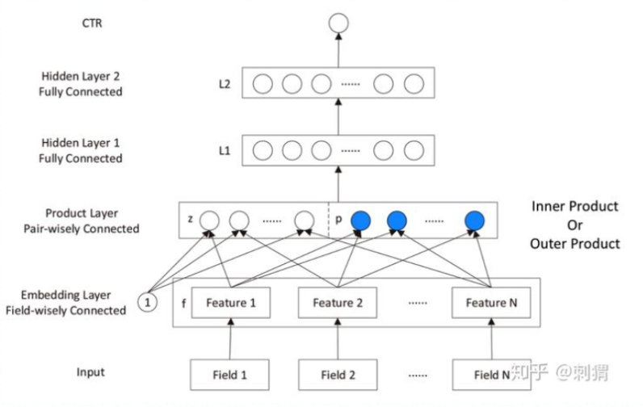
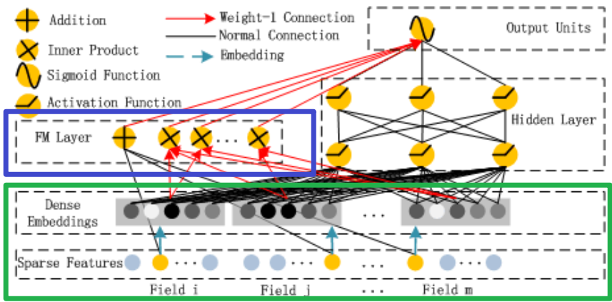
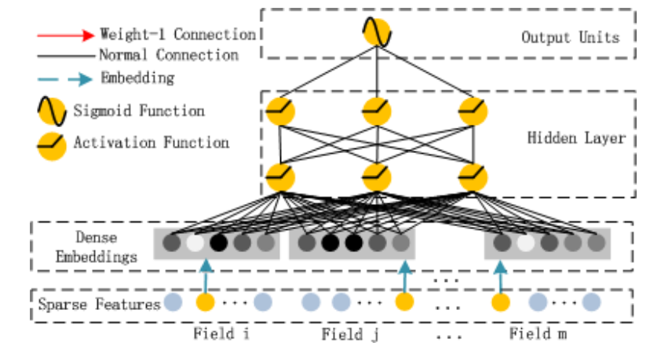

# Task2 精排模型：DeepFM, DIN

## DeepFM模型

1. 模型产生动机：如何高效地学习特征组合？

   为了解决这个问题，出现了FM和FFM来优化LR的特征组合较差这一个问题。并且在这个时候科学家们已经发现了DNN在特征组合方面的优势，所以又出现了FNN和PNN等使用深度网络的模型。但是DNN也存在局限性。

   - DNN局限：维度灾难（输入时onehot会导致维度大大增加）。为了解决这个问题，我们通过不将所有编码全连接，分而治之来降低参数，如图所示：

   

   

   这个时候再通过一个全联接层就可以实现高阶特征的组合，如：

   

   但是低阶特征的特征组合仍然没有考虑到，因此我们用FM来表示低阶特征的特征组合，最后想办法结合FM和DNN来构造最终的网络。

   - FNN和PNN：    我们先来了解一下FNN的思想，这对之后理解DeepFM比较有帮助。

     FNN的思想比较简单，直接在预训练好的FM上接入若干全连接层。利用DNN对特征进行隐式交叉，可以减轻特征工程的工作，同时也能够将计算时间复杂度控制在一个合理的范围内（如图所示  ：w代表一阶特征的权重，$v_i, v_j$代表fm训练好的隐向量）。后来演变成了PNN。

     

     因为有人发现在Embedding layer和hidden layer1 中增加一个product层可以提高模型的表现，于是使用product layer替换了FM预训练层，形成如下结构，提出了PNN

     

   - Wide&Deep：纵观以上模型，我们发现尽管FNN和PNN模型能够学好低阶组合特征，但是再串行通过全连接层后还是相当于学了高阶特征，低阶特征本身无法在DNN的输出端有较好的表现。

     很自然的想到直接把低阶特征并行地加上去不就好了。于是google提出了Wide&Deep模型（如下所示）。虽然将整个模型的结构调整为了并行结构，在实际的使用中Wide Module中的部分需要较为精巧的特征工程，换句话说人工处理对于模型的效果具有比较大的影响（这一点可以在Wide&Deep模型部分得到验证）。

     

     缺陷：**在output Units阶段直接将低阶和高阶特征进行组合，很容易让模型最终偏向学习到低阶或者高阶的特征，而不能做到很好的结合。**

     然后综合以上所有思想，我们就得到了DeepFM。

     

2. DeepFM模型结构与原理

   先来看一下模型结构：

   

   对比着wide&deep模型来看：

   特征部分（绿框）：处理方式和上面相同，将稀疏向量变成稠密embedding

   wide部分（蓝框）：将fm layer替换了原来的wide部分。

   然后我们把fm部分和deep部分的拆开来看

   - FM部分

     数学表示：$\hat{y}_{FM}(x)=w_0+\sum_{i=1}^{N}w_ix_i+\sum_{i=1}^{N}\sum_{j=i+1}^{N}v_i^Tv_jx_ix_j$

     含义：输出=偏置+一阶特征组合+权重*二阶特征交叉，其中权重为两个特征的embedding内积，FM训练的就是这个权重embedding。

     架构图：

     

     从图中可以看出，我们单独考虑了linear部分和FM特征交叉部分

   - Deep部分

     架构图：

     

     Deep Module的目的是为了学习高阶的特征组合，在上图中使用用全连接的方式将Dense Embedding输入到Hidden Layer，这里面Dense Embeddings同样是为了解决DNN中的参数爆炸问题。

     在经过两层mlp后直接加入sigmoid函数激活，就是deep部分的整体架构

3. 代码实战

   代码链接：https://colab.research.google.com/drive/1dSASWaBFf50Z1rw4itqENDkv1MIvIiWL?usp=sharing 

   链接中包含DeepFM, Wide&Deep，DCN的简易实现方式，以及DeepFM借助rechub组件的复现方式。

   总结一下，框架和sample里搭的框架一摸一样，就是模型的参数需要记一下.

   DeepFM主要参数如下：

   - deep_features指用deep模块训练的特征（兼容dense和sparse），
   - fm_features指用fm模块训练的特征，只能传入sparse类型
   - mlp_params指定deep模块中，MLP层的参数

   

​		