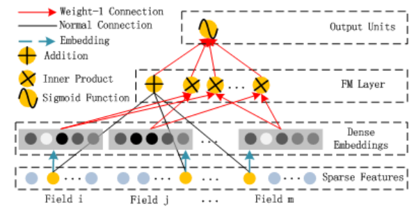
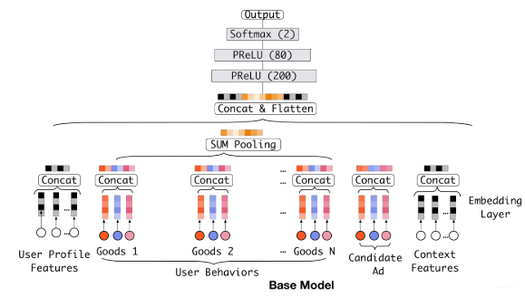
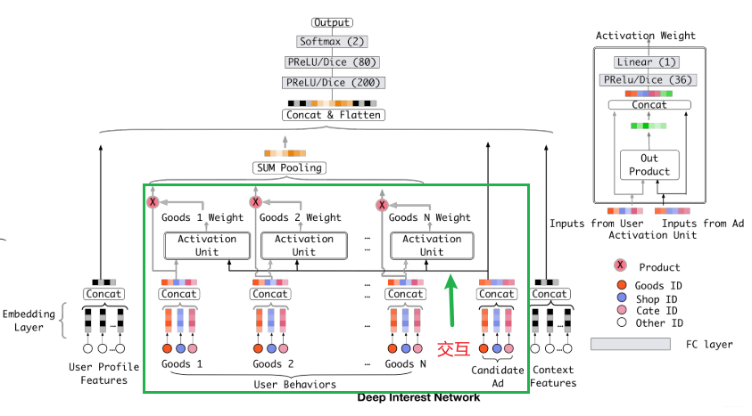
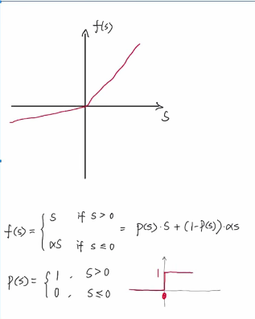
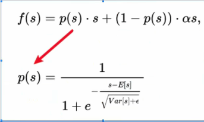

# Task2 精排模型：DeepFM, DIN

## FM模型家族

在详细了解DeepFM模型前，我们先从FM模型家族说起：

1. 特征交叉的开始：POLY2模型

   在fm系列出现前，主流的模型有逻辑回归，矩阵分解等。这些模型都没有主动考虑到特征之间的交叉。针对这个问题，以前往往是由算法工程师手动进行特征组合然后再人工筛选完成的。但这个方法无疑是非常低效的，因此人们自然地考虑到使用模型进行暴力特征组合来解决这个问题。

   - 特征交叉的重要性：

     首先我们来提一下特征交叉的重要性，为什么非常需要考虑交叉特征呢？一个典型的例子是辛普森悖论，我们对群体进行分组后得到的每组的结论，居然和不分组得到的结论完全不一样。可见有时候不考虑组合特征会让模型学到完全偏离事实的信息。

   - 暴力组合特征：POLY2模型（二阶交叉特征）

     数学公式：特征交叉相乘然后带权重求和。
     $$
     POLY2(w,x)=\sum_{j_i=1}^{n} \sum_{j_2=j_i+1}^n w_{h(j_1,j_2)x_{j_1}x_{j_2}}
     $$
     其中$w_{h(j_1,j_2)}$代表交叉项的权重，$w$代表这个权重组成的矩阵，我们的目的就是学出这个权重矩阵，同时由于这个矩阵是symmetric的，我们只需要用到它的一半，这也是为什么累加是从1到n和$j_i+1$到n。

      该模型存在两个较大的缺陷：

     - 由于输入的类别特征一般都是one-hot编码，本来就非常稀疏，两个特征交叉相乘会导致向量更加稀疏，直接导致大部分交叉项缺少有效数据，训练无法收敛。
     - 由于我们需要学出w权重矩阵，复杂度为O(n^2)，显然这个训练开销不太能够被接受。

2. 隐向量特征交叉：FM模型

   为了解决复杂度过高的问题，2010年FM被提出，核心思想在于将权重矩阵分解为两个隐向量做内积的形式（因为权重矩阵w symmetric，则必存在半正定的矩阵V使得$W=VV^T$）于是原来的数学公式变为：
   $$
   FM(w,x)=\sum_{j_1=1}^{n} \sum_{j_2=j_1+1}^n (v_{j_1}\cdot v_{j_2})x_{j_1}x_{j_2}
   $$
   其中$v_{j_1},v_{j_2}$代表分解完后的矩阵的第$j_1,j_2$列，这个隐向量同时也能表示为某个特定特征的embedding。

   - FM模型的优势：

     1. 极大降低了训练开销，由$O(n^2)$降为了$O(kn)$，其中k为隐向量的长度，往往$k<<n$，

     2. 隐向量的引入使FM能够更好地解决数据稀疏性的问题

        原因在于我们优化学习的目标由矩阵变成了隐向量，梯度下降的优化目标为：
        $$
        v_{jk}:=v_jk+\alpha*\frac{1}{m}\sum_{l=1}^{m}(y^{(l)}-\hat{y}^{(l)})\cdot[x_j^{(l)}(\sum_{i=1}^n v_{ik} \cdot x_i^{(l)})-v_{jk}x_j^{(l)2}]
        $$
        可以发现对于
        $$
        [x_j^{(l)}(\sum_{i=1}^n v_{ik} \cdot x_i^{(l)})-v_{jk}x_j^{(l)2}]
        $$
        这一项，只要行/列中有一个值不为0，梯度下降的值就不为0，这大大降低了稀疏向量出现的概率

     3. FM模型利用了两个特征的Embedding做内积得到权重，这个Embedding可以保存在离线，随时拿出来用

   - 缺点：只能照顾到特征的二阶交叉，对于更高阶的交叉无能为力

我们了解了FM的发展，接着我们再结合深度网络进一步思考，来看看加入了深度网络会不会使特征交叉的学习更加高效呢？

## DeepFM模型

1. 模型产生动机：如何高效地学习特征组合？

   为了解决这个问题，出现了FM和FFM来优化LR的特征组合较差这一个问题。并且在这个时候科学家们已经发现了DNN在特征组合方面的优势，所以出现了FNN和PNN等使用深度网络的模型。但是DNN也存在局限性。

   - DNN局限：维度灾难（输入时onehot会导致维度大大增加）。为了解决这个问题，我们通过不将所有编码全连接，分而治之来降低参数，如图所示：

   

   

   这个时候再通过一个全联接层就可以实现高阶特征的组合，如：

   

   但是低阶特征的特征组合仍然没有考虑到，因此我们用FM来表示低阶特征的特征组合，最后想办法结合FM和DNN来构造最终的网络。

   - FNN和PNN：    我们先来了解一下FNN的思想，这对之后理解DeepFM比较有帮助。

     FNN的思想比较简单，直接在预训练好的FM上接入若干全连接层。利用DNN对特征进行隐式交叉，可以减轻特征工程的工作，同时也能够将计算时间复杂度控制在一个合理的范围内（如图所示  ：w代表一阶特征的权重，$v_i, v_j$代表fm训练好的隐向量）。后来演变成了PNN。

     

     因为有人发现在Embedding layer和hidden layer1 中增加一个product层可以提高模型的表现，于是使用product layer替换了FM预训练层，形成如下结构，提出了PNN

     

   - Wide&Deep：纵观以上模型，我们发现尽管FNN和PNN模型能够学好低阶组合特征，但是再串行通过全连接层后还是相当于学了高阶特征，低阶特征本身无法在DNN的输出端有较好的表现。

     很自然的想到直接把低阶特征并行地加上去不就好了。于是google提出了Wide&Deep模型（如下所示）。虽然将整个模型的结构调整为了并行结构，在实际的使用中Wide Module中的部分需要较为精巧的特征工程，换句话说人工处理对于模型的效果具有比较大的影响（这一点可以在Wide&Deep模型部分得到验证）。

     

     缺陷：**在output Units阶段直接将低阶和高阶特征进行组合，很容易让模型最终偏向学习到低阶或者高阶的特征，而不能做到很好的结合。**

     然后综合以上所有思想，我们就得到了DeepFM。

     

2. DeepFM模型结构与原理

   先来看一下模型结构：

   

   对比着wide&deep模型来看：

   特征部分（绿框）：处理方式和上面相同，将稀疏向量变成稠密embedding

   wide部分（蓝框）：将fm layer替换了原来的wide部分。

   然后我们把fm部分和deep部分的拆开来看

   - FM部分

     数学表示：$\hat{y}_{FM}(x)=w_0+\sum_{i=1}^{N}w_ix_i+\sum_{i=1}^{N}\sum_{j=i+1}^{N}v_i^Tv_jx_ix_j$

     含义：输出=偏置+一阶特征组合+权重*二阶特征交叉，其中权重为两个特征的embedding内积，FM训练的就是这个权重embedding。

     架构图：

     

     从图中可以看出，我们单独考虑了linear部分和FM特征交叉部分

   - Deep部分

     架构图：

     

     Deep Module的目的是为了学习高阶的特征组合，在上图中使用用全连接的方式将Dense Embedding输入到Hidden Layer，这里面Dense Embeddings同样是为了解决DNN中的参数爆炸问题。

     在经过两层mlp后直接加入sigmoid函数激活，就是deep部分的整体架构

3. 代码实战

   代码链接：https://colab.research.google.com/drive/1dSASWaBFf50Z1rw4itqENDkv1MIvIiWL?usp=sharing 

   链接中包含DeepFM, Wide&Deep，DCN的简易实现方式，以及DeepFM借助rechub组件的复现方式。

   总结一下，框架和sample里搭的框架一摸一样，就是模型的参数需要记一下.

   DeepFM主要参数如下：

   - deep_features指用deep模块训练的特征（兼容dense和sparse），
   - fm_features指用fm模块训练的特征，只能传入sparse类型
   - mlp_params指定deep模块中，MLP层的参数

## DIN模型

“沿着特征工程自动化的思路，深度学习从PNN一路走来，经过了大量wide&deep、Deep&Cross、FNN、DeepFM、NFM等模型，进行了大量的、基于不同特征交互操作思路的尝试，模型进一步提升的空间已经非常小了，这也是这类模型的局限所在。” （by 王喆《深度学习推荐系统》）

于是在这之后，越来越多的深度模型开始尝试结构上的尝试，如探索序列模型，加入注意力机制等，阿里巴巴提出的DIN模型就是其中的典型代表之一

模型提出基于的核心观察点在于：

- 电商广告推荐业务场景下，**存在着大量的用户历史行为信息**，这种用户历史行为信息无疑是非常重要的。举个深度学习推荐系统书中的例子，如果一个人的历史购买行为是鼠标，化妆品，护肤品，那么推荐键盘的重要性显然大于推荐洗面奶。
- **用户的兴趣多种多样，且变化多端**。
- **用户的兴趣往往蕴含在其历史行为数据中**。
- 对于用户点不点击当前商品广告，很大程度上**依赖于用户的历史行为**。

然而，之前所有特征工程自动化的深度学习模型，是没办法很好表达用户在不同时间下的广泛兴趣的。在之前的FM系列模型中，如果想要学习的兴趣更加广泛，那么只能通过牺牲复杂度去增加隐向量的维度。这个在电商广告推荐场景下，本来就存在超大规模的一阶特征的情况下，是非常不利的。此外，**也并不是用户所有的历史行为都会对某个商品广告点击预测起到作用**，所以很多情况下不用考虑所有用户历史行为。

于是设计DIN的动机就很自然地了解了：**我们应当让模型自适应地去捕捉用户的兴趣变化。**

如何做到呢？既然我们只需要focus在部分有价值的历史行为数据与当前候选广告的**关联性**上，对历史行为数据加个注意力不就好了。通过加入注意力机制，模型能够更好地学习到用户的兴趣变化。于是，作者把注意力引入到了模型中，设计了一个"local activation unit"结构，利用候选商品和历史商品之间的相关性计算出权重，就代表对于当前商品广告的预测。我们来具体看下模型：

### DIN模型结构及原理

我们先来看两块小内容：DIN模型的数据集/特征表示， 还有base模型

1. 数据集与特征表示

   一般工业CTR的数据特征都是muti-group categorical form，如图

   

   一般的类别数据都用one-hot来处理，很好理解。但是对于id等这种数据，这个对于不同用户来说显然是多值型的特征（不同用户买的同一个商品个数不一样），这里一般都用multi-hot来编码，即：同一个编码间会出现多个1。成功编码后编码如下所示：

   

   再举一个例子，比如一个人在一周时间内游览的物品id记录是$[11, 0,0,6,0,24,33]$，那么换成multihot之后就变成了$[0,\cdots,1,\cdots,1,\cdots,1]$在第6,11,24,33位是1，其余位全是0的mutihot编码。

   注意这里编码过程中没有做任何特征交叉

2. base模型

   这里的base模型指的是上文提到的Embedding&MLP的形式，我们将这样的网络作为baseline然后对它进行改进。其实din只不过在这个基础上加了一个新的注意力结构来学习当前候选物品与用户历史行为特征的相关性，从而动态捕捉用户的兴趣

   base模型的结构如下：主要分为Embedding layer, Pooling&Concat layer 和MLP三大模块：

   

   这里User Behaviours中不同颜色的点代表着某一个物品的某一项特征转化后的muti-hot编码

   - Embedding layer: 

     目的：将高维稀疏向量转换成低维稠密向量

     其中每个离散特征下面都会对应一个embedding，维度是D*K，D代表隐向量的维度，K表示onehot类别个数。举个例子，比如Weekday的特征：

     假设某个用户的weekday特征就是周五，化成one-hot编码的时候，就是[0,0,0,0,1,0,0]表示，这里如果再假设隐向量维度是D， 那么这个特征对应的embedding词典是一个$D\times7$的一个矩阵(每一列代表一个embedding，7列正好7个embedding向量，对应周一到周日)，那么该用户这个one-hot向量经过embedding层之后会得到一个$D\times1$的向量，表示周五对应的那个embedding（计算过程：$embedding矩阵* [0,0,0,0,1,0,0]^T$ ），即直接把embedding矩阵中one-hot向量为1的那个位置的embedding向量拿出来。 这样就得到了稀疏特征的稠密向量了。其他离散特征也是同理，知识multi-hot编码会得到一个embedding向量的列表，因为他开始的那个multi-hot向量有不止一个1。通过这个层，上面的输入特征都可以拿到相应的稠密embedding向量了。

   - Pooling&Concat layer:

     这里的pooling操作有两个目的：

     1. 将大量embedding拼接的同时进行数据降维
     2. 将每个用户历史行为的最终特征变成相同长度。需要这么做的原因是：在上文中我们知道，对于mutihot编码的数据（比如在编码中出现m个1），经过embedding layer后会变成有m个元素的D维embedding列表，这样不同人拼接后的embedding layer就不等长了。因此我们这里强制让他们变成等长的embedding送入之后的mlp

     因为以上两个原因，就有了：
     $$
     e_i=pooling(e_{i1}, e_{i2},\cdots,e_{ik})
     $$
     这里$e_{ij}$指用户历史行为的embedding，$i$表示第$i$个历史特征组（历史行为+商品特征等组成一组），k表示历史特征组中用户购买过的商品数量，经过pooling之后拼接，然后输入进MLP

   - MLP：全连接层

   - Loss:

     对于CTR预估，是二分类问题，这里使用BCE损失函数：
     $$
     L= - \frac{1}{N}\sum_{(x,y)\in S}(y\log p(x)+(1-y)\log(1-p(x)))
     $$

   以上就是base model，总结一下有以下缺点，然后我们开始改进：

   - 用户的历史行为交互特征和候选物品的特征在进入MLP之前没有任何的交互（组合/交叉）
   - 而虽然拼起来embedding给了神经网络后有了交互，但是无脑直接拼接所有的embedding会丢失信息+引入噪声（有些物品的embedding并没有实际用途，比如很久很久以前买的东西）
     - 【丢失信息】没法看出用户所有历史中到底那个对当前商品比较相关，丢失了历史行为中各个商品对当前预测的重要性程度
     - 【引入噪声】sum pooling综合了所有商品，但并不是每个商品都有用，因此引入了噪声

   回到我们开头说的，如果我们引入注意力机制，学习当前的候选广告和用户的历史行为的关联性，就可以捕捉到用户变化的兴趣。DIN通过给定一个候选广告，然后去注意与该广告相关的局部兴趣的表示来模拟此过程。 DIN不会通过使用同一向量来表达所有用户的不同兴趣，而是通过考虑历史行为的相关性来自适应地计算用户兴趣的表示向量（对于给的广告）。 该表示向量随不同广告而变化。下面看一下模型的具体结构：

3. DIN模型架构

   

   - 先来看输入端的特征，这里红色的点代表的是物品id的one-hot编码，经过embedding层后出来了物品的embedding表示。

   - 然后就是和basemodel最大的不同：这里candidate Ad和每一个goods都两两进行了交互（黑色箭头）。交互后输出了一个权重（Activation weight）代表着这个历史物品和候选物品的关联性，然后这个物品的本身embedding会和这个权重相乘（灰色箭头）得到最后的结果（红色x点），最后这个结果再进行sum pooling来得到一样的长度，灰色箭头整体就是表示一个加权求和的过程。

     总结下，输入：历史行为和当前商品。输出：关联性。然后把关联性作为权重加权求和。这直接就对应了注意力机制的三个步骤：Query, key, F(Q,K)。

     此外相比注意力机制，这里的权重系数最终没有做归一化处理，目的是为了保留用户的兴趣强度（如果进行归一化了，相当于变成了百分比，那么历史购买记录很多的人对于每个物品的兴趣的权重会变得很小，不利于和历史购买记录少的人一起比较）

   - 然后我们来看下这个activation unit中究竟干了什么事情，对于注意力机制，其实有很多算权重的办法（比如算cand与history间的余弦相似度等，核心在于要表达出相似性）。这里的Activation unit中采用的操作是把输入的history和candidate先做element-wise product（每个位置的元素相乘，来表达相似度），然后把相乘的embedding和原先的embedding拼接，拼接后进入mlp最终输出一个weight，

     为什么要用这种结构?（其实个人感觉如果是为了表示相似度，其它有大量的方法可以完成这个事情）

     个人理解：这个注意力权重也是需要学的，因此必须用mlp结构来使得模型具有学习能力。这里通过拼接embedding的方式使模型既考虑了history与cand的相似度，也考虑到了history和cand物品本身（和fm的结构类似）

4. 训练方式

   介绍完了这个网络架构，接下来我们来看下它是怎么训练的，在这篇论文中，阿里巴巴提出了两种有创新性的训练方式：

   1. **Mini-batch Aware Regularization**

      - 面临问题：

        - 用户数据有长尾分布，出现次数很多的往往是小部分特征，大多数特征只出现了几次，容易过拟合（把出现次数非常少的数过拟合进来了）。
        - 对于过拟合，通常都会使用正则，dropout，但是这些方法效果都不是很好。比如计算l2正则时，会有非常繁重的计算，且不可接受地会扩展到有数亿参数，造成复杂度的原因在于每个特征对应的embedding矩阵的更新会导致大量参数的更新，然后算l2需要算所有参数的norm再相加。

      - 解决策略：

        - Mini-batch：只在小批量（出现过的稀疏特征参数）进行l2 norm的计算，对于全为0的特征直接不进行更新
        - 自适应正则：对出现过的特征，根据特征出现的频率，动态地调整正则化强度。出现评率低的特征正则化强一些

      - 数学表示：

        - L2全局表示(mini batch)：
          $$
          L_2(W)=\|{W}\|_2^2=\sum_{j=1}^K{\|{w_j}\|_2^2}=\sum_{(x,y)\in B}\sum_{j=1}^{K}\frac{I(x_j\neq0)}{n_j}\|w_j\|_2^2
          $$
          K：特征维数

          B：批量中的样本

          $w_j$：权重的值

          $x_j$：样本中1出现多少次

          $I(x_j\neq0)$：如果所有值都为0，$I=0$，略过不算这个的正则，如果出现了n次1，$I(x_j\neq0)=n$，那么$L_2(W)=\sum_{(x,y)\in S}\sum_{j=1}^{K}\|w_j\|_2^2$

          $n_j$：特征出现的个数，出现越多正则越小

        - 加入自适应后的表示：

          令$\frac{I(x_j\neq0)}{n_j}=\alpha$，这个$\alpha$能够帮助我们略过计算值全为0的向量的权重，那么为了实现自适应aware，再除一个$n_j$即可
          $$
          L_2(W)=\|{W}\|_2^2=\sum_{j=1}^K{\|{w_j}\|_2^2}=\sum_{j=1}^{K}\sum_{m=1}^B\frac{\alpha_{jm}}{n_j}\|w_j\|_2^2
          $$
          这样就完美实现了以上的解决方案

        - 梯度更新：
          $$
          w_j\larr w_j-\eta \bigg[ \frac{1}{|\Beta_m|}\sum_{(x,y)\in \Beta_m}\frac{\partial L(p(x),y)}{\partial w_j}+\lambda \frac{\alpha_{mj}}{n_j}w_j \bigg]
          $$
          其中只有第m个小批量中的特征参数参与正则化计算

   2. **Data Adaptive Activation Function**

      - 面临问题

        - ICS问题（每层输入的数据分布可能不一样，从而引发一系列问题）

          比如使用PRelu激活函数，如果数据大部分分布在小于0的部分时，梯度更新会非常慢，会产生梯度消失的问题

          

        - 解决方案的思路在于1）手动改变数据分布(Batch-normalization)

          2）设计一个可以自动适应数据分布的一个激活函数（将函数向左/向右平移）

      - 解决方案：

        1. 使用数据的均值E[s]来决定激活函数断点（非线性点）的位置

           

        2. 使用sigmoid函数代替p(s)，来使得激活函数更加平滑

        由此得到了dice激活函数

        

        

        对于f(s)图像，我们由均值控制左右移动，方差控制平滑度的胖瘦

   

​	

参考资料：

1. 王喆：《深度学习推荐系统》
2. b站up主：老弓的学习日记
3. datawhale组队学习内容