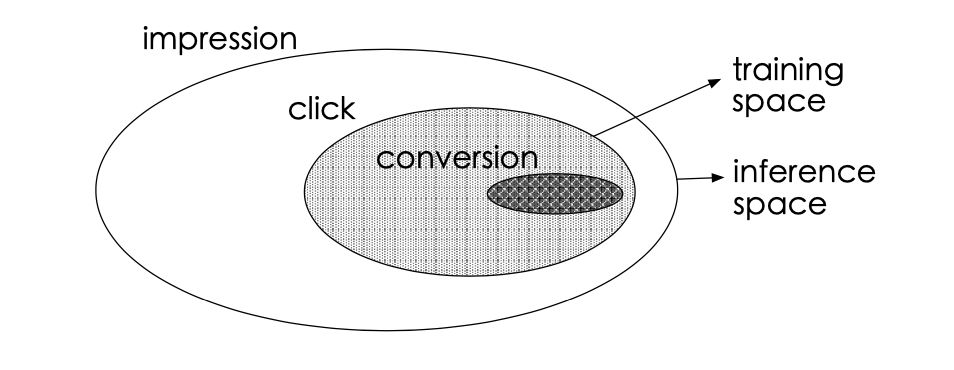
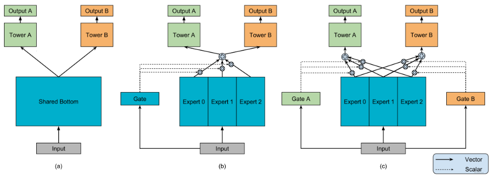

# Task4 多任务模型：ESMM, MMOE

## 一 背景知识

1. **多任务多目标学习**

   多任务(Multi-task learning)：指同时完成多个目标的机器学习方式

   多目标(Multi-objective leaning)：时MTL的一种，在具体业务场景中，往往我们需要同时优化多个目标。比如视频推荐需要同时优化点击率和完播率，电商推荐需要同时优化点击率和转化率。如今CTR预估领域采用多任务多目标时比较主流的建模方式。

   首先来厘清一些名词概念。如下图，解释了Multi-Task 与 Multi-Label等相关概念的关系。

   Multi-Task learning：多任务学习建模多个任务之间的关联关系，任务输入可以是不同的feature/sample，如BERT的MLM预训练任务与NSP任务，两个任务先后训练，输入是不同的feature和sample。这是Multi-Input & Multi-Output （MIMO） 的类型，常用的训练模式是pre-train+finetuning 和 多任务co-train交替训练。

   Multi-Label learning：还有一种是Single-Input & Multi-Output （SIMO） ，就是非常常见的Multi-Label Learning，建模相同feature、相同Sample上多个label之间的关系。也常称之为多目标Multi-Objective。如CV领域中，对同一image，可以同时对semantic classification，depth regression，instance regression等诸多经典任务目标共同学习。CTR领域，对同一输入样本同时预估点击率、转化率多个目标。常用的训练模式是Joint-train的模式，形式化地表达如下：
   $$
   L=min_{\theta}\sum_{t=1}^{T}\alpha^tL^t(\theta_{sh},\theta_{t})
   $$
   其中$\theta_{sh}$是多任务共享参数，$\theta_{t}$是任务t 的独享参数，Joint-train的总Loss是各个子任务对应Loss的带权求和。本文后面称的多任务多目标学习，默认是这种建模方式。

2. 优势与挑战

   - 优势：共享参数会在效果和性能层面带来优势

     效果：多任务学习的效果提升原因如下：

     - 任务互助：某个任务难以学到的特征，可以通过其它特征学习。
     - 隐式数据增强：不同任务噪声不同，一起学习可抵消部分噪声。多个任务共同学习，能够缓解某些任务样本稀疏导致的过拟合。
     - 提高通用性，增强泛化能力：模型学到的是对所有任务通用的权重，有助于推广到新任务。

     性能：多任务较N个单任务网络参数量总和显著降低，在实时预测场景下MTL模型效率也更高。

   - 挑战：

     多任务多目标为了实现 1+1>2，在任务参数空间上设置了假设，例如:任务参数应该彼此靠近，w.r.t.一些距离度量，共享一个共同的概率先验，或驻留在一个低维子空间或流形。当所有任务都是相关的时候，这些假设可以很好地工作，但是如果在不相关的任务之间发生信息共享，则大概率导致效果下降，出现跷跷板（某个任务效果变好，另一个变差）、负迁移（所有效果都变差）的现象。

   因此多任务领域核心的研究问题在于：**如何能够利用好共享的参数，多个任务互相帮助，共同提升**

## 二 多任务学习研究目标概览

多任务学习的核心优势在于通过不同的网络之间的参数共享，实现1+1>2的效果。目前主流的研究方向有两个。

- 网络结构设计：

  研究哪些参数可以共享，在什么位置共享，如何共享。

  主要分为两大类：

  - 设计网络结构时，考虑目标间的显式关系（例如淘宝中，点击之后才有购买行为发生），以阿里提出的ESMM为代表；

  - 目标间没有显示关系（例如短视频中的收藏与分享），在设计模型时不考虑label之间的量化关系，以谷歌提出的MMOE为代表。

- 多loss的优化策略：

  主要解决loss数值有大有小、学习速度有快有慢、更新方向时而相反的问题。最经典的两个工作有：

  UWL（Uncertainty Weight）：通过自动学习任务的uncertainty，给uncertainty大的任务小权重，uncertainty小的任务大权重；

  GradNorm：结合任务梯度的二范数和loss下降梯度，引入带权重的损失函数Gradient Loss，并通过梯度下降更新该权重。

然后我们来看一下几种简单的实现方式：

### loss加权融合

一种最简单的实现多任务学习的方式是对不同任务的loss进行加权。例如谷歌的Youtube DNN论文中提到的一种加权交叉熵：
$$
\text { Weighted CE Loss }=-\sum_{i}\left[T_{i} y_{i} \log p_{i}+\left(1-y_{i}\right) \log \left(1-p_{i}\right)\right] 
$$
其中$T_i$为观看时长。在原始训练数据中，正样本是视频展示后用户点击了该视频，负样本则是展示后未点击，这个一个标准的CTR预估问题。该loss通过改变训练样本的权重，让所有负样本的权重都为 1，而正样本的权重为点击后的视频观看时长 $T_i$。作者认为按点击率排序会倾向于把诱惑用户点击（用户未必真感兴趣)的视频排前面，而观看时长能更好地反映出用户对视频的兴趣，通过重新设计loss使得该模型在保证主目标点击的同时，将视频观看时长转化为样本的权重，达到优化平均观看时长的效果。

另一种更为简单粗暴的加权方式是人工手动调整权重，例如 0.3*L(点击)+0.7*L\*(视频完播)

这种loss加权的方式优点如下：

- 模型简单，仅在训练时通过梯度乘以样本权重实现对其它目标的加权
- 模型上线简单，和base完全相同，不需要额外开销

缺点：

- 本质上并不是多目标建模，而是将不同的目标转化为同一个目标。样本的加权权重需要根据AB测试才能确定。

### Shared-Bottom

最早的多任务学习模型是底层共享结构（Shared-Bottom），如图所示。

通过共享底层模块，学习任务间通用的特征表征，再往上针对每一个任务设置一个Tower网络，每个Tower网络的参数由自身对应的任务目标进行学习。Shared Bottom可以根据自身数据特点，使用MLP、DeepFM、DCN、DIN等，Tower网络一般使用简单的MLP。

优点：

- 浅层参数共享，互相补充学习，任务相关性越高，模型loss优化效果越明显，也可以加速训练。

缺点：

- 任务不相关甚至优化目标相反时（例如新闻的点击与阅读时长），可能会带来负收益，多个任务性能一起下降。

一般把Shared-Bottom的结构称作“参数硬共享”，多任务学习网络结构设计的发展方向便是如何设计更灵活的共享机制，从而实现“参数软共享”。

## 三 ESMM模型

我们先来看ESMM模型，**ESMM**(Entire Space Multi-Task Model)是2018年由阿里妈妈团队针对任务依赖而提出。比如电商推荐中的多目标预估经常是ctr和cvr，其中转换这个行为只有在点击发生后才会发生。

1. 背景与动机

   传统CVR预估问题中存在两个主要问题：样本选择偏差以及稀疏数据

   - 样本选择偏差(Sample selection bias)：

     首先我们来看一下业务场景中的数据：

     

     其中传统cvr训练的数据是{点击未转换，点击同时转换}（灰色圈），CTR训练的数据是{点击，未点击}（白色圈）。而在线上预测的场景下，一旦物品曝光，我们就需要推断出他们的CTR以及CVR来排序。按照传统的方案，就会出现训练推断样本不一致的情况，这一定程度上违背了机器学习中训练数据和测试数据独立同分布的假设。

   - 训练数据稀疏(data sparsity)：转换样本只占点击样本中很小的一部分，如果只用点击后的数据训练cvr模型，可用的样本会极其稀疏。

2. 解决方案

   恰好多任务学习能够隐式地做数据增强，由此想到可以使用多任务学习来解决这个问题。我们用同样的数据同时优化CTR和CVR即可。同时ESMM又增加了CTCVR来进一步表示全样本的优化目标，三个预测任务如下：

   - pCTR：$P(click=1 | impression)$

   - pCVR：$P(conversion=1|click=1,impression)$

   - pCTCVR：$P(conversion=1,click=1|impression)$

     其中根据贝叶斯公式：
     $$
     pCTCVR=pCTR*pCVR
     $$

   于是基于之前的shared-bottom的模型改进，可以自然地想到对两个任务构建不同的DNN，输入dnn的底层参数共享，最后相乘出pCTCVR

   模型架构如下：

   

   损失函数：损失函数由具有监督信息的CVR和CTCVR任务组成：
   $$
   L(\theta_{cvr},\theta_{ctr})=\sum_{i=1}^Nl(y_i,f(x_i;\theta_{ctr}))+\sum_{i=1}^Nl(y_i\&z_i,f(x_i;\theta_{ctr})\times f(x_i;\theta_{cvr})
   $$
   $l()$为交叉熵损失函数。

   同时这里有些细节：

   1. 为什么不使用CTCVR/CVR来得到CTR，用CTR来做有监督的标签？答案是由于CVR通常非常非常小，通过一个非常小的数作为分母容易引起数值不稳定的问题。事实上训练结果也不是很好(DIVISION的得分低于ESMM)

   

   - BASE：经典的CVR预测任务，也就是ESMM 左半边；
   - AMAN、OVERSAMPLING、UNBIAS：分别是几种学术界缓解样本间偏差和数据稀疏问题的方法；
   - DIVISION： 分别训练pCTCVR、pCTR，然后pCTCVR除以pCTR。
   - ESMM-NS：不共享embedding 层的ESMM
   - ESMM ：本文提出的模型。

   2. loss比起直接相加可不可以引入带权重的相加？

   模型是如何解决之前提出的两个问题的：？

   - 帮助CVR模型在完整样本空间建模。
     $$
     p(x=1|y=1,x)=\frac{p(y=1,z=1|x)}{p(y=1|x)}
     $$

    从公式中可以看出，pCVR 可以由pCTR 和pCTCVR推导出。从原理上来说，相当于分别单独训练两个模型拟合出pCTR 和pCTCVR，再通过pCTCVR 除以pCTR 得到最终的拟合目标pCVR 。在训练过程中，模型只需要预测pCTCVR和pCTR，利用两种相加组成的联合loss更新参数。pCVR 只是一个中间变量。而pCTCVR和pCTR的数据是在完整样本空间中提取的，从而相当于pCVR也是在整个曝光样本空间中建模。

   - 提供特征表达的迁移学习（embedding层共享）。CVR和CTR任务的两个子网络共享embedding层，网络的embedding层把大规模稀疏的输入数据映射到低维的表示向量，该层的参数占了整个网络参数的绝大部分，需要大量的训练样本才能充分学习得到。由于CTR任务的训练样本量要大大超过CVR任务的训练样本量，ESMM模型中特征表示共享的机制能够使得CVR子任务也能够从只有展现没有点击的样本中学习，从而能够极大地有利于缓解训练数据稀疏性问题。

   模型训练完成后，可以同时预测cvr、ctr、ctcvr三个指标，线上根据实际需求进行融合或者只采用此模型得到的cvr预估值。

## MMOE模型

MMOE模型是2018年由谷歌提出的，全称是Multi-gate Mixture-of-Experts。解决的问题是如果hard bottom-share中多个任务相似性不是很强的话，底层embedding学习反而相互影响，最终都学不好的痛点

1. 背景与动机：

   我们先来回顾一下前文说的shared-bottom的方法：

   

   - Hard-parameter sharing：直接共享底层所有参数。

     这种方法目前用的也有，比如美团的猜你喜欢，知乎推荐的Ranking等， 这种方法最大的优势是Task越多， 单任务更加不可能过拟合，即可以减少任务之间过拟合的风险。 但是劣势也非常明显，就是底层强制的shared layers难以学习到适用于所有任务的有效表达。 **尤其是任务之间存在冲突的时候**。MMOE中给出了实验结论，当两个任务相关性没那么好(比如排序中的点击率与互动，点击与停留时长)，此时这种结果会遭受训练困境。

   - Soft-parameter sharing：既然共享所有参数会出问题，很自然的想法是共享部分参数就行了。对于不同的任务选择不同的参数共享，假设一组参数是一个专家，我们使用多个专家（即多个tower）。然后对不同人物给不同的tower分配权重，这样就可以允许底层使用不同的专家针对不同的任务了。而且这种方式也显得更加灵活。这个范式对应的结果从 MOE->MMOE->PLE

   通过上面的描述，我们知道了hard parameter sharing不能很好的权衡特定任务之间的冲突关系。这也就是MMOE模型提出的动机， 那么下面的关键就是MMOE模型是怎么建模任务之间的关系的，又是怎么能使得任务间的关系保持平衡的？

2. MMOE模型结构

   

   上图是一个模型逐渐演进的过程，hard-shared-bottom -> MOE -> MMOE

   i) MOE

   首先引入多个专家表达不同的任务，每个专家都需要有各自的权重，这里引入一个门控网络机制来做到这件事情。数学表示如下
   $$
   y=\sum_{i=1}^{n}g(x)_if_i(x)  \\
    \sum_{i=1}^ng(x)_i=1
   $$
   其中$g(x)_i$表示权重，$f_i(x)$表示每个专家的输出

参考资料：

https://datawhalechina.github.io/fun-rec/#/ch02/ch2.2/ch2.2.5/2.2.5.0

https://developer.aliyun.com/article/793252

https://zhuanlan.zhihu.com/p/291406172
