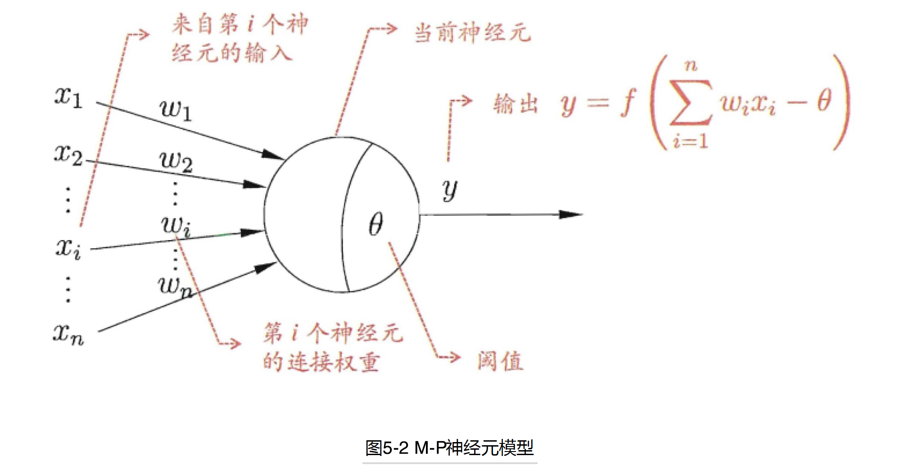

# 第五章：神经网络

## 5.1 神经元模型

最经典的神经元模型是M-P神经元模型，它对人的神经情况进行了模拟。如果我们将整个模型看作细胞的话，可以把它分成两部分：前一部分计算输入信号的加权和，后一部分计算总输入值与神经阈值的差别，然后通过激活函数（通常是Sigmoid函数）来把输入值挤压到（0，1）间然后传递给其它神经元。工作过程如下：

把多个神经元按照一定的层次连接起来，就得到了神经网络。神经网络是一个含有多个参数的模型。比如10个神经元两两连接，就会需要100个参数（9个连接权重和一个阈值参数）。整个模型就是通过这些函数相互嵌套而成。

M-P神经元的输出如下：
$$
y = f(\sum_{i=1}^{n}w_ix_i-\theta)
$$
其中$w_i$是权重，$\theta$是阈值

## 5.2 感知机与多层网络

1. 感知机模型：

   代数解释：感知机的激活函数为阶跃函数sgn，通过比较加权和和阈值来决定分类结果，主要通过训练集来训练出权重以及阈值
   $$
   y = sgn(w^Tx-\theta) = \begin{cases}
   1 & w^Tx-\theta >=0 \\
   0 & w^Tx-\theta <0
   \end{cases}
   $$
   几何解释：对于一个线性可分的数据集，感知机会学习一个能够将正负样本完全划分开的的超平面，其中$w^Tx-\theta$是超平面方程。$w^T$为法向量。

   进一步的个人理解：在二维平面上的超平面是一条线，这条线由$w^T,b$确定，对于阶跃函数，线左边为1，右边为0，把这个压缩到一维平面实际上就是该函数的图像。所以$w^T-\theta$确定平面，激活函数确定分类方式

2. 学习策略：

   我们构建损失函数要基于这两个要求：

   1）如果没有错误分类点，则损失为0

   2）分类错误点离超平面越近，损失越小

   因此我们构建了以下的损失函数：
   $$
   L(w,\theta) = \sum_{x\in m}(\hat{y}-y)(w^Tx-\theta)
   $$
   然后我们可以通过扩张矩阵把$w^Tx-\theta$写成$Z\beta$的形式（参见线性回归章节），这里我们把$Z\beta$写作$w^Tx_i$。

3. 优化方式：

   感知机的学习算法采用随机梯度下降法，我们先求得关于$w$的梯度为：
   $$
   \nabla_wL(w) = \sum_{x_i\in M}(\hat{y_i}-y_i)x_i
   $$
   随机梯度下降要求每次随机取一个样本进行梯度下降，于是我们得到$w$的更新公式为
   $$
   w \leftarrow w+\Delta w
   $$

   $$
   \Delta w  = -\eta(\hat{y_i}-y_i)x_i
   $$

   $where\ \eta \ is\ learning\ rate$

   最终通常解出的$w$不唯一。

4. 神经网络：多个神经元构成神经网络。有理论证明，只需一个包含足够多的神经元的隐层，多层前馈网络能够以任意精度逼近任意复杂度的连续函数。因此神经网络既能做分类也能做回归，

   进一步理解，实际上多层的神经网络在每一层都进行了一次训练，相当于自动做了特征工程（特征组合/降维等），因此神经网络不用特别复杂的特征工程。

5. 多层前馈网络：同层跨层不互联，相邻层全部连接。

   我们把神经网络（记为NN）看作一个特征加工函数$NN(x)$

   $NN(x)$是一个$ x\in R^d \rightarrow x\in R^l$ 的映射

   对于回归任务，最后一层加一个 $R^l\rightarrow R$ 的神经元即可，例如$y=w^Tx-\theta$

   对于分类任务，最后一层加一个 $R^l\rightarrow [0,1]$ 的神经元即可，例如sigmoid函数

## 5.3 误差逆传播算法（Error BackPropagation）

我们假设隐层和输出层神经元都用Sigmoid函数，且需要完成一个多输出的回归任务，因此损失函数采用均方误差，分类任务用交叉熵。假设某个训练样本的特征$y_k = (y_1^k,y_2^k,\cdots,y_l^k)$，多层前馈网络的输出为$\hat{y_k} = (\hat{y_1^k},\hat{y_2^k},\cdots,\hat{y_j^k})$，则单个样本的均方误差为
$$
E_k = \frac{1}{2}\sum_{j=1}^{l}(\hat{y_j^k}-y_j^k)^2
$$
基于随机梯度下降：
$$
w \leftarrow w+\Delta w
$$

$$
\Delta w  = -\eta(\hat{y_i}-y_i)x_i
$$

注意：因为NN(x)是非常复杂的非凸函数，往往这种优化到的都是局部极小值/

具体的求解流程是这样的：BP算法执行以下操作：现将输入示例提供给输入层神经元，然后逐层将信号向前传递，直到到输出层，然后计算输出层的误差，把该误差逆向传播到隐层，最后根据隐层神经元的误差来对连接权和阈值做调整，循环直到达到停止条件为止。